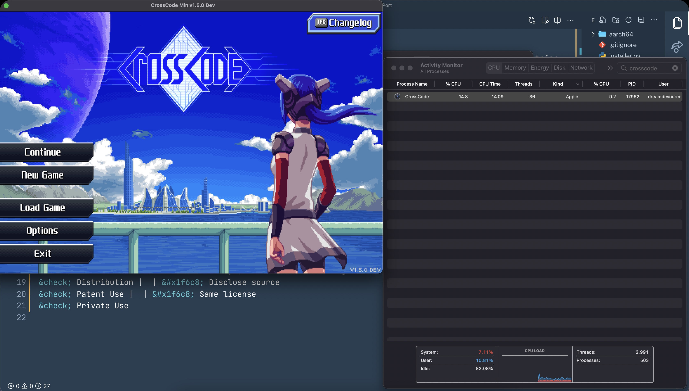
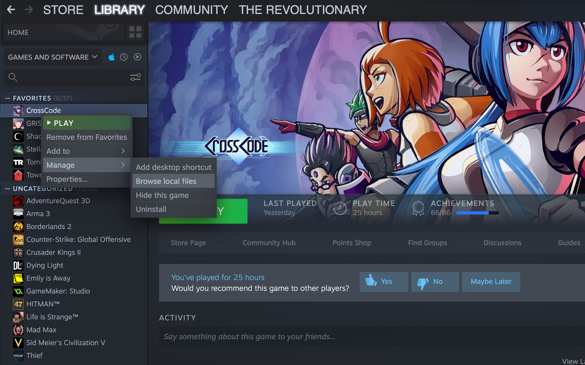
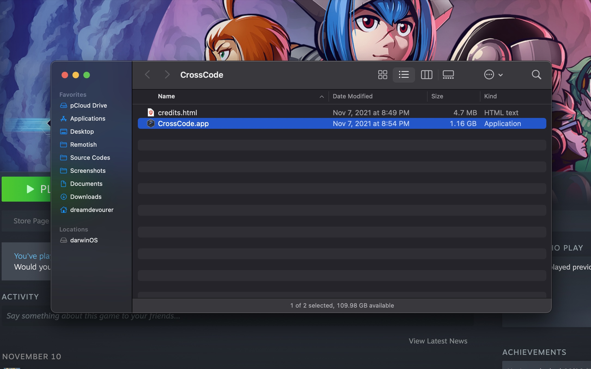

<h1 align="center">CrossCode Mac M1 Native Patcher 🦿</h1>

<p align="center">This is just a simple patcher for CrossCode to work natively on M1 Macs. This patch contains compiled darwin aarch64 binaries of NWJS.</p>

<p align="center">
  <a href="./LICENSE">License</a>
</p>



## ⚙️ Instructions

1 - Download the zip of master branch manually or by running:

```bash
git clone https://github.com/DreamDevourer/CrossCode-Mac-M1-Port.git
```

2 - Move the installer.py with aarch64 folder and start.sh to where the CrossCode.app is located (Probably your default Steam installation folder).

You can easily land in the game folder by using the Steam menus:




After moving the files to the game folder and before starting, make sure you have Python 3.7 or later installed. If you are not sure, open the terminal where the scripts are and just run the start.sh with your preferred shell. Follow the patch instructions and have fun!

```bash
./start.sh
```

3 - Open the terminal where the script is located and run [You can skip this if you ran start.sh]:

```bash
python3 installer.py
```

4 - Follow the patch instructions.

5 - After the patch is done, you can run CrossCode.app normally.

## ✍️ Updating NWJS binaries

This is an annotated version of `Building NW.js` from the official NW.js developer documentation.
It includes my experience from building NW.js binaries for macOS, both Intel (x86-64) and M1 (arm64).


### Prerequisites

NW.js use same build tools and similar steps as Chromium. Read the instructions according to your platform to install `depot_tools` and other prerequistes:

* [Windows](https://chromium.googlesource.com/chromium/src/+/master/docs/windows_build_instructions.md)
* [Mac OS X](https://chromium.googlesource.com/chromium/src/+/master/docs/mac_build_instructions.md)
* [Linux](https://chromium.googlesource.com/chromium/src/+/master/docs/linux_build_instructions.md)

><span class="notes">TL;DR for Mac: Install Xcode (full, not command-line tools, unfortunately), then</span>
```
git clone https://chromium.googlesource.com/chromium/tools/depot_tools.git
export PATH="$PATH:$PWD/depot_tools"
```

### Get the Code

**Step 1.** Create a folder for holding NW.js source code, like `$HOME/nwjs`, and run following command in the folder to generate `.gclient` file:

```bash
mkdir -p $HOME/nwjs
cd $HOME/nwjs
gclient config --name=src https://github.com/nwjs/chromium.src.git@origin/nw57
```

Generally if you are not interested in running Chromium tests, you don't have to sync the test cases and reference builds, which saves you lot of time. Open the `.gclient` file you just created and replace `custom_deps` section with followings:

```python
"custom_deps" : {
    "src/third_party/WebKit/LayoutTests": None,
    "src/chrome_frame/tools/test/reference_build/chrome": None,
    "src/chrome_frame/tools/test/reference_build/chrome_win": None,
    "src/chrome/tools/test/reference_build/chrome": None,
    "src/chrome/tools/test/reference_build/chrome_linux": None,
    "src/chrome/tools/test/reference_build/chrome_mac": None,
    "src/chrome/tools/test/reference_build/chrome_win": None,
}
```

Manually clone and checkout correct branches for following repositories:

| path | repo |
|:---- |:---- |
| src/content/nw | https://github.com/nwjs/nw.js |
| src/third_party/node-nw | https://github.com/nwjs/node |
| src/v8 | https://github.com/nwjs/v8 |

><span class="notes">For a quick copy-paste (replace nw57 with the version branch you want to build):</span>
>```
>B=nw57
>git clone -b $B https://github.com/nwjs/nw.js src/content/nw
>git clone -b $B https://github.com/nwjs/node src/third_party/node-nw
>git clone -b $B https://github.com/nwjs/v8 src/v8
>```

**Step 2.** Run following command in your terminal:
```
gclient sync --with_branch_heads
```

This usually downloads 20G+ from GitHub and Google's Git repos. Make sure you have a good network provider and be patient :stuck_out_tongue:

When finished, you will see a `src` folder created in the same folder as `.gclient`.

!!! note "First Build on Linux"
    If you are building on Linux **for the first time**, you need to run `gclient sync --with_branch_heads --nohooks` and then run `./build/install-build-deps.sh` to install dependencies on Ubuntu. See [Chromium document](http://dev.chromium.org/developers/how-tos/get-the-code) for detailed instructions of getting the source code.

## Generate ninja build files with GN for Chromium

```bash
cd src
gn gen out/nw  # (changing the 'nw' part of the path is not supported. You'd better not change the 'out' part if you're new to this)
```

Use flags like our official build:
````
is_debug=false
is_component_ffmpeg=true
target_cpu="x64"
````
We support component build: `is_component_build = true` for faster development cycle. It should be used when you are trying to build debug version.

><span class="notes">(In case you are not a Ninja) Arguments can be set either by editing `out/nw/args.gn` or via the `--args` command-line flag.
    Here is the full command line used by the official Mac build (taken from http://buildbot-master.nwjs.io:8010/builders/nw57_sdk_mac64/builds/10/steps/gn/logs/stdio):</span>
>```
>gn gen out/nw '--args=is_debug=false is_component_ffmpeg=true target_cpu="x64" symbol_level=1 enable_nacl=true proprietary_codecs=true ffmpeg_branding="Chromium" enable_stripping=true enable_dsyms=true enable_precompiled_headers=false'
>```

><span class="notes">For M1, set `target_cpu="arm64"` and remove `enable_nacl=true`.</span>
>
>(Why is NaCl even enabled in buildbot? It is a deprecated framework.)

See the upstream documentation for the mapping between GN and GYP flags: https://chromium.googlesource.com/chromium/src/+/master/tools/gn/docs/cookbook.md#Variable-mappings

## Generate ninja build files with GYP for Node

```bash
cd src
GYP_CHROMIUM_NO_ACTION=0 ./build/gyp_chromium -I \
third_party/node-nw/common.gypi -D building_nw=1 \
-D clang=1 third_party/node-nw/node.gyp
```

or use the following if you're doing a component build:
```bash
./build/gyp_chromium -D component=shared_library -I \
third_party/node-nw/common.gypi -D building_nw=1 \
-D clang=1 third_party/node-nw/node.gyp
```

><span class="notes">Requires Python 2; since you probably have Python 3 and it is the default, make the following changes.</span>
> 1. patch `third_party/node-nw/common.gypi`, replacing 
>```
>python -c "import sys; print sys.byteorder"
>```
>with
>```
>python2 -c "import sys; print sys.byteorder"
>```
>2. patch `src/tools/gyp/pylib/gyp/mac_tool.py`, replacing
>```
>#!/usr/bin/env python
>```
>with (you guessed it)
>```
>#!/usr/bin/env python2
>```
>3. prefix the command with `python2`, e.g.
>```
>GYP_CHROMIUM_NO_ACTION=0 python2 ./build/gyp_chromium -I \
>third_party/node-nw/common.gypi -D building_nw=1 \
>-D clang=1 third_party/node-nw/node.gyp
>```

To change the build configuration for Node, you need to setup the GYP_DEFINES environment variable:

### 32-bit/64-bit Build

* Windows
    - 32-bit: is the default build target
    - 64-bit: `set GYP_DEFINES="target_arch=x64"` and rebuild in `out/Debug_x64` or `out/Release_x64` folder
* Linux
    - 32-bit: **TODO: chroot**
    - 64-bit: is the default build target
* Mac
    - 32-bit: `export GYP_DEFINES="host_arch=ia32 target_arch=ia32"` and rebuild in `out/Debug` or `out/Release` folder
    - 64-bit: is the default build target

><span class="notes">For Mac, the default does not work for some reason. Use `export GYP_DEFINES="target_arch=x64"` for x86-64, or `export GYP_DEFINES="target_arch=arm64"` for M1.</span>
>
>Here is the full definition from buildbot (x86-64):
>```
>export GYP_DEFINES="target_arch=x64 building_nw=1 nwjs_sdk=1 disable_nacl=0 mac_breakpad=1 buildtype=Official"
>```

### Build nwjs

ninja build files are generated in `out/nw` folder after you run GN. Run following command in your terminal will generate the Debug build of standard NW.js binaries in `out/nw` folder:

```bash
cd src
ninja -C out/nw nwjs
```

><span class="notes">For Mac: with the minimal set of parameters, the Ninja action `nw/dump` will fail due to unmet dependencies.
>This can be skipped by editing `content/nw/BUILD.gn`, removing the block that starts with `if (is_mac && !is_component_build)`.</span>

To build 32-bit/64-bit binaries or non-standard build flavors, you need to edit out/nw/args.gn file And then re-run the commands above to generate binaries.

### Build Node

```bash
cd src
ninja -C out/Release node
```

After building Node, the final step is to copy the build Node library to the nwjs binary folder:

```bash
cd src
ninja -C out/nw copy_node
```

### Build Flavors

* Standard: `nwjs_sdk=false`
* SDK: `enable_nacl=true`
><span class="notes">On M1, NaCl does not build. Just drop it. (See earlier note.)</span>

See [Build Flavors](../For Users/Advanced/Build Flavors.md) for the differences of all supported build flavors.

### Enable Proprietary Codecs

Due to the license issue, the prebuilt binaries of NW.js doesn't support proprietary codecs, like H.264. So you can't play MP3/MP4 with `<audio>` and `<video>` tags with prebuilt NW.js. To enable those medias, you have to build NW.js from source code by following the document of [Enable Proprietary Codecs](Enable Proprietary Codecs.md).


### Documentation

From Google's website, there are a few tips to speed up your build. Open the links below to see the tips for your platform:

* [Mac Build Instructions: Faster builds](https://chromium.googlesource.com/chromium/src/+/master/docs/mac_build_instructions.md#Faster-builds)
* [Tips for improving build speed on Linux](https://chromium.googlesource.com/chromium/src/+/master/docs/linux_faster_builds.md)
* [How to run apps](https://github.com/nwjs/nw.js/wiki/How-to-run-apps)
* [How to package and distribute your apps](https://github.com/nwjs/nw.js/wiki/How-to-package-and-distribute-your-apps)
* [How to use Node.js modules in node-webkit](https://github.com/nwjs/nw.js/wiki/Using-Node-modules)

## 📄 License

Permissions of this strong copyleft license are conditioned on making available complete source code of licensed works and modifications, which include larger works using a licensed work, under the same license. Copyright and license notices must be preserved. Contributors provide an express grant of patent rights.

| Permissions | Restrictions | Conditions
| --- | --- | --- 
&check; Commercial Use | &times; Liability | &#x1f6c8; License and Copyright Notice
&check; Modification   | &times; Warranty | &#x1f6c8; State changes
&check; Distribution |  | &#x1f6c8; Disclose source
&check; Patent Use |  | &#x1f6c8; Same license
&check; Private Use
